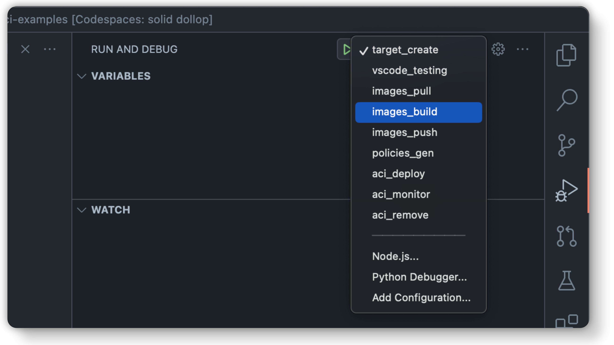

# Confidential ACI Examples

Example code and end to end test cases for confidential ACI.

All examples utilise the `c_aci_testing` package to manage images and deployment which can be found at:

[microsoft/confidential-aci-testing](https://github.com/microsoft/confidential-aci-testing).

If you're looking for a simple tests running in multiple regions, as well as uptime and performance testing, see:

[microsoft/confidential-aci-dashboard](https://github.com/microsoft/confidential-aci-dashboard).

If you're looking for examples of how to use confidential sidecar container images, see the `tests/` directory at:

[microsoft/confidential-sidecar-containers](https://github.com/microsoft/confidential-sidecar-containers)

## Examples

### [Python Server](examples/python_server/README.md)
[](https://github.com/microsoft/confidential-aci-examples/actions/workflows/python_server.yml)

Basic flask based server running in a confidential container.

### [Sidecar](examples/sidecar/README.md)
[](https://github.com/microsoft/confidential-aci-examples/actions/workflows/sidecar.yml)

Deploys two containers in the same container group and demostrates communication between the two.

### [Remote Images](examples/remote_image/README.md)
[](https://github.com/microsoft/confidential-aci-examples/actions/workflows/remote_images.yml)

Deploys several container groups using popular docker images

### [Attestation](examples/attestation/README.md)
[](https://github.com/microsoft/confidential-aci-examples/actions/workflows/attestation.yml)

Fetches and validates an SNP Attestation report.

## How to Run Examples

There are three main ways to run examples:

### 1. Github Actions

Every example has a corresponding github action.

See all workflows [here](https://github.com/microsoft/confidential-aci-examples/actions).

### 2. Whole Tests Locally

The simplest way to run the tests locally is to use Github Codespaces.

[](https://github.com/codespaces/new?hide_repo_select=true&ref=main&repo=616412316&machine=standardLinux32gb&devcontainer_path=.devcontainer%2Fdevcontainer.json&location=WestEurope)

This will set up a full development environment with everything needed to run examples.

> **CREDENTIALS:** In order to deploy Azure resources, you will need to run `az login` with an account with Contributor permissions on the resource group specified in `cacitesting.env`

> **MANUAL SETUP:** To checkout and setup manually, please refer to the [Dev Container](.devcontainer/devcontainer.json) to follow the setup process.

Then you can open VS Code's testing view, where examples can be run with or without a debugger.

<p align="center">
    
</p>


### 3. Locally Step by Step

If a particular step of an example needs debugging, they can be run manually through [VS Codes Run and Debug View](https://code.visualstudio.com/docs/editor/debugging#_launch-configurations). Most examples follow these steps:

1. Build Images
2. Push Images
3. Pull Images (If already pushed)
4. Generate a security policy
5. Deploy ACIs
6. Monitor running ACIs
7. Remove ACIs

<p align="center">
    
</p>

Once the deployment is complete, you can run the corresponding test against it without doing a full deployment again.

### [EXPERIMENTAL] Running examples against Container Platform

> Note: For now, use the branch `vm_backend` to do this

You can currently run the following examples against Container Platform.

- Simple Server
- Remote Image

To do so, log into Azure with an account which has access to both the Azure DevOps repository for ContainerPlatform, and the Atlas Image on which it runs. To do this, either set the environment variable BACKEND=VM, or when running each step manually, use the following steps:

1. Build and Push Images
2. Generate VM ARM Template
3. Deploy Container Platform
4. Run Container Platform

## How to Add New Examples

### 1. Create a new target with `c_aci_testing`

Either use the `target_create` Run & Debug option, or run in terminal:

```
c-aci-testing target create examples/my_example --name my_example
```

This creates a template for the new target, containing a bicep file and a docker compose file where you can specify the images to build and deploy.

### 2. Add client side tests

Either use the `vscode_testing` Run & Debug option, or run in terminal:

```
c-aci-testing target add_test examples/my_example
```

This adds a placeholder python `unittest` based test which will deploy the target and give you a context in which to do your testing.

### 3. Add Github Actions workflows

Either use the `github_workflow_create` Run & Debug option, or run in terminal:

```
c-aci-testing github workflow examples/my_example
```

This creates a placeholder github actions workflow.

---

## Contributing

This project welcomes contributions and suggestions. Most contributions require you to agree to a
Contributor License Agreement (CLA) declaring that you have the right to, and actually do, grant us
the rights to use your contribution. For details, visit https://cla.opensource.microsoft.com.

When you submit a pull request, a CLA bot will automatically determine whether you need to provide
a CLA and decorate the PR appropriately (e.g., status check, comment). Simply follow the instructions
provided by the bot. You will only need to do this once across all repos using our CLA.

This project has adopted the [Microsoft Open Source Code of Conduct](https://opensource.microsoft.com/codeofconduct/).
For more information see the [Code of Conduct FAQ](https://opensource.microsoft.com/codeofconduct/faq/) or
contact [opencode@microsoft.com](mailto:opencode@microsoft.com) with any additional questions or comments.

## Trademarks

This project may contain trademarks or logos for projects, products, or services. Authorized use of Microsoft
trademarks or logos is subject to and must follow
[Microsoft's Trademark & Brand Guidelines](https://www.microsoft.com/en-us/legal/intellectualproperty/trademarks/usage/general).
Use of Microsoft trademarks or logos in modified versions of this project must not cause confusion or imply Microsoft sponsorship.
Any use of third-party trademarks or logos are subject to those third-party's policies.
