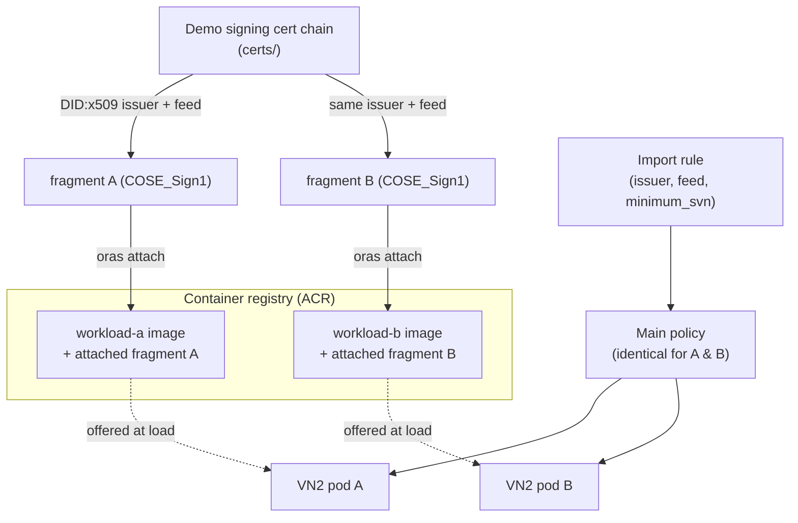

# Image-attached fragments with VN2

A walkthrough of using an image-attached CCE policy fragment with VN2
(Confidential ACI via
[Virtual Node 2](https://github.com/microsoft/virtualnodesOnAzureContainerInstances)
on AKS).

This README shows how to produce and use an image-attached fragment step by
step. The terms *policy*, *fragment*, *issuer*, *feed* and *DID:x509* are
introduced inline as they come up.

Not all regions support fragments for VN2 yet.

---

## The goal: a stable policy

The workload runs under a CCE security policy. A relying party (the gatekeeper)
releases secrets based, in part, on the hash of that policy. If the policy
changes, its hash changes, and the relying party must be reconfigured to trust
the new hash.

A "normal" policy pins the exact layer hashes of every container image, so every
rebuild changes the policy and its hash — coupling your key-release
configuration to your image release cadence.

An image-attached fragment breaks that coupling:

- The main policy contains only a *fragment rule*: "trust any fragment signed by
  *this issuer* under *this feed* with SVN ≥ *N*". It does not name the workload
  image.
- The workload's real authorisation (its image layer hashes) lives in a fragment
  that is signed and attached to the image in the registry.
- At load time the runtime discovers the attached fragment, *offers* it to the
  policy engine inside the TEE, and merges its rules in if the fragment rule is
  satisfied.

Because the workload's hashes are in the fragment, the main policy stays
byte-for-byte identical across image versions. This example proves it: it builds
two *different* workload images (A and B) and shows both run under the same main
policy hash.

---

## What this example does

- Builds two different workload images, `workload-a` and `workload-b` (they
  differ only in the string they print, so their image hashes differ).
- Signs and attaches an image-attached fragment to each image, both under the
  same issuer and feed.
- Generates one main policy that imports that fragment, and injects it into two
  VN2 pod definitions (one per image).
- Verifies that the two injected main policies are identical, and that both pods
  start.



---

## Prerequisites

You must provide these yourself (the `Makefile` will *not* install them):

- Azure CLI with the `confcom` extension: `az extension add --name confcom`
- `docker` (with `buildx`) and `kubectl`
- An AKS cluster with VN2 installed, and your `kubeconfig` pointing at it
- An Azure Container Registry you can push to
- `envsubst` and `curl` (used by the `Makefile`)

The `Makefile` *does* download two helper tools on demand into `./bin`:

- [`oras`](https://oras.land/) — attaches the fragment artifact to the image in
  the registry.
- [`sign1util`](https://github.com/microsoft/cosesign1go/tree/main/cmd/sign1util)
  — creates and inspects the COSE_Sign1 envelope that wraps the fragment.

---

## Quick start

```bash
make            # build images, create + sign + attach fragments, generate the main policy
make deploy     # create the ACR pull secret and kubectl apply the two pods
make verify     # wait for both pods and confirm they started
```

Configuration is set at the top of the [`Makefile`](Makefile) and can be
overridden on the command line, e.g.:

```bash
make REGISTRY=myregistry.azurecr.io REPO_BASE=fragment-vn2 TAG=demo
```

The sections below walk through each phase.

---

## Step-by-step walk-through

### Step 1 — Establish a signing identity (the issuer)

A fragment must be signed, and the issuer in a fragment rule is a
[`DID:x509`](https://github.com/microsoft/did-x509) derived from the signing
certificate chain. So you first need a chain to sign with.

```bash
make certs
```

This runs [`certs/create_certchain.sh`](certs/create_certchain.sh), which builds
a demo root → intermediate → leaf chain and produces:

- `CHAIN = certs/intermediateCA/certs/www.contoso.com.chain.cert.pem`
- `KEY   = certs/intermediateCA/private/ec_p384_private.pem`

The issuer DID is computed later from this chain with:

```bash
sign1util did-x509 -chain "$CHAIN" -policy CN
```

`-policy CN` pins the leaf's subject common name as the stable identifier.
The DID is a hash of the root certificate combined with that pinned leaf field,
so anyone can verify "this fragment was signed by the holder of that root,
issuing a leaf with that CN".

> **Production note:** this demo chain is labelled *do not trust* and its key
> sits on disk. In production, keep the signing key in a secret store such as
> Azure Key Vault (ideally HSM-backed), give the root a long lifetime (20+ years)
> and the leaf a shorter one (~1 year). The *issuer* stays stable as long as the
> root and the leaf's pinned field stay stable.

### Step 2 — Build and push the workload images

```bash
make images
```

Builds and pushes [`containers/workload-a`](containers/workload-a) and
[`containers/workload-b`](containers/workload-b). They differ only in the string
they print (`Hello from workload A` vs `B`), so their image layer hashes differ
— which is what lets us later prove the main policy is stable *despite* the
images being different.

The build flags `--provenance=false --sbom=false` keep each pushed image a
single manifest, required so a fragment can be attached directly to it with
`oras`.

### Step 3 — Generate, sign and attach the fragment

```bash
make fragments
```

For each image, the `Makefile` runs four sub-steps:

1. **Generate the unsigned fragment rego** from the container config
   ([`workload_config.json.template`](workload_config.json.template), rendered
   per image):

   ```bash
   az confcom acifragmentgen \
       --input workload-a-config.json \
       --svn 1 --namespace contoso \
       --no-print --output-filename workload-a-fragment
   ```

   This produces the *fragment* that authorises this specific image. The `--svn`
   (security version number) and `--namespace` are part of the fragment's
   identity.

2. **Sign it** into a COSE_Sign1 envelope with `sign1util`, using the chain and
   key from Step 1 and the shared feed:

   ```bash
   issuer=$(sign1util did-x509 -chain "$CHAIN" -policy CN)
   sign1util create -algo ES384 -chain "$CHAIN" -key "$KEY" \
       -claims workload-a-fragment.rego -out workload-a-fragment.rego.cose \
       -salt zero -feed "$FEED" -content-type application/unknown+rego -issuer "$issuer"
   ```

   The feed (`$(REGISTRY)/$(REPO_BASE)`, e.g.
   `myregistry.azurecr.io/fragment-vn2`) is the stable label a policy uses to
   refer to a fragment. Both workloads use the same issuer and feed — the reason
   a single main-policy rule can admit either one.

3. **Attach** the signed fragment to the image in the registry with `oras`:

   ```bash
   oras attach "$WORKLOAD_A_IMAGE" \
       --artifact-type application/x-ms-ccepolicy-frag \
       workload-a-fragment.rego.cose:application/cose-x509+rego
   ```

   This makes it an image-attached fragment: it lives next to the image in the
   registry, so the runtime discovers and *offers* it whenever that image is
   loaded.

4. **Emit the import rule** — the small JSON snippet the main policy uses to
   *trust* this fragment:

   ```bash
   az confcom acifragmentgen --generate-import \
       -p workload-a-fragment.rego.cose --minimum-svn 1 \
       --fragments-json import-a.json
   ```

   Because both fragments share the same issuer + feed + SVN, `import-a.json` and
   `import-b.json` are identical; the `Makefile` asserts this with `cmp` and
   keeps one as `fragment_import_rules.json` — an
   `{issuer, feed, minimum_svn, includes}` entry that a main policy can trust.

> The `Makefile` splits generate/sign/attach into separate commands for clarity.
> `az confcom acifragmentgen` can do all three in one call if you pass the
> signing key/chain and an `--image-target`; see the comment above the
> `fragments:` target in the [`Makefile`](Makefile).

### Step 4 — Generate the stable main policy and inject it into the VN2 pods

```bash
make yaml
```

This renders two VN2 pod definitions from
[`deployment.yaml.template`](deployment.yaml.template) — differing only by name
and image — into a single multi-document `deployment.yaml`, then generates and
injects the main policy:

```bash
az confcom acipolicygen --virtual-node-yaml deployment.yaml \
    --include-fragments --fragments-json fragment_import_rules.json
```

- `--virtual-node-yaml` targets a VN2 pod manifest (rather than an ACI ARM
  template).
- `--include-fragments --fragments-json fragment_import_rules.json` adds the
  import rule to the main policy instead of pinning the workload image directly.

The generated main policy therefore contains the *fragment rule* plus the
mandatory `pause` container every VN2 main policy needs — but not the workload
image's layer hashes, which only exist in the attached fragment.

The `Makefile` then extracts the injected `ccepolicy` annotation from each pod
and checks they are equal:

```
OK: both pods share an identical main policy (fragment-based)
```

Two different images, one identical, stable main policy.

### Step 5 — Deploy to VN2

```bash
make deploy
```

This does two things:

1. `make pullsecret` — creates a Kubernetes `docker-registry` secret so VN2 can
   pull from your ACR (VN2 requires an explicit pull secret), using a short-lived
   ACR token:

   ```bash
   token=$(az acr login -n "$REGISTRY_NAME" --expose-token --query accessToken -o tsv)
   kubectl create secret docker-registry "$PULL_SECRET" \
       --docker-server="$REGISTRY" \
       --docker-username=00000000-0000-0000-0000-000000000000 \
       --docker-password="$token"
   ```

2. `kubectl apply -f deployment.yaml` — schedules both pods.

The VN2-specific bits of the manifest ([`deployment.yaml.template`](deployment.yaml.template))
are:

- `nodeSelector: { virtualization: virtualnode2 }` and the
  `virtual-kubelet.io/provider` toleration, which place the pod on the VN2
  virtual node.
- `imagePullSecrets`, referencing the secret above.
- The `microsoft.containerinstance.virtualnode.injectdns: "false"` annotation.
- The `ccepolicy` annotation, filled in by `confcom` in Step 4 (left as a
  comment in the template).

### Step 6 — Verify

```bash
make verify
```

Waits for both deployments to roll out and confirms each pod logged
`Workload container started`:

```
Both workloads started under the same main policy -- fragments work.
```

That completes the loop: two independently versioned images, each authorised by
its own image-attached fragment, both admitted by a single stable main policy —
the property that lets a relying party keep trusting the same policy hash across
image updates.

---

## Cleanup

```bash
make remove     # delete the pods and the pull secret from the cluster
make clean      # remove generated configs, fragments, policies, manifest and ./bin
```

The generated artifacts (`workload-*-config.json`, `*.rego`, `*.rego.cose`,
`import-*.json`, `fragment_import_rules.json`, `deployment.yaml`, `logs-*.txt`)
and the downloaded `bin/` are git-ignored.

---

## Notes for production

- **Protect the signing key.** Use a secret store / HSM (e.g. Azure Key Vault)
  rather than an on-disk key, and use a real (globally trusted) root so your
  issuer is meaningful. Keep the root long-lived and the leaf short-lived.
- **Keep the issuer + feed stable.** They are the identity the main policy trusts.
  Rotating the *leaf* is fine as long as the pinned field (here, the CN) and the
  root stay the same, so the DID:x509 is unchanged.
- **Use SVN as a floor.** `--minimum-svn` in the import rule lets you raise the
  accepted version over time to retire older fragments without changing the main
  policy hash.

## References

- `confcom` extension: <https://github.com/Azure/azure-cli-extensions/blob/main/src/confcom/azext_confcom/README.md>
- `sign1util` / cosesign1go: <https://github.com/microsoft/cosesign1go>
- `oras`: <https://oras.land/>
- DID:x509: <https://github.com/microsoft/did-x509>
