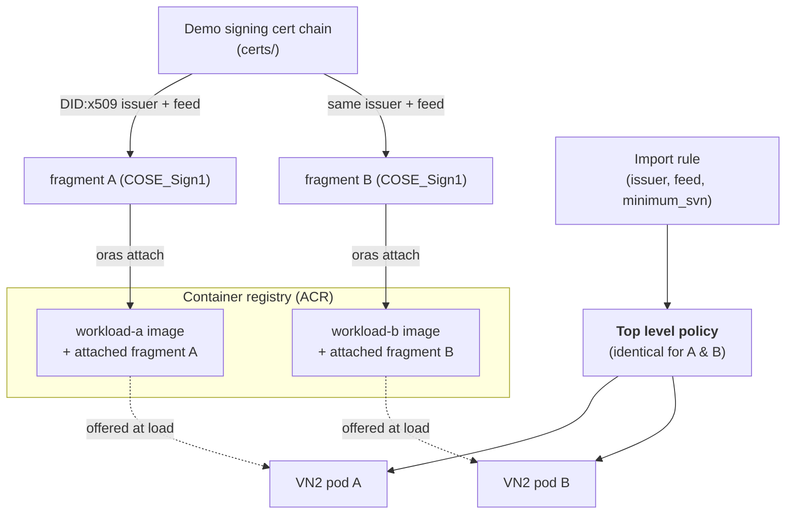

## Servicable containers using stable policy

A typical Confidential workload uses an attestation in order to gate access to a secret. In this example, we will discuss using mHSM to store the secret.

```text
 C-WCOW Container        Microsoft Azure Attestation        Managed HSM
        |                            |                            |
        |  Attestation report        |                            |
        |  + collaterals             |                            |
        |--------------------------->|                            |
        |                            |                            |
        |         MAA token          |                            |
        |<---------------------------|                            |
        |                                                         |
        |             MAA token + wrapping key                    |
        |-------------------------------------------------------->|
        |                                                         |
        |               Encrypted key material                    |
        |<--------------------------------------------------------|
        |                                                         |
```

mHSM has a key release policy. That key release policy must be immutable to prevent operators with RBAC access stealing the key, and this means that a new key needs to be generated every time the key release policy changes. This means that it is expensive to change the CCE security policy of a confidential container when the image needs to be updated. This makes servicing container workloads difficult.

Our goal is to keep the key release policy stable to avoid this as much as possible. The hash of the CCE policy is part of the mHSM key release policy, thus the CCE policy must be stable as well.

We do this by adding a layer of indirection between the CCE policy provided at pod startup (to avoid confusion we will call that the "top level policy") and the effective policy. This allows the effective policy to be serviced without changing the initial startup policy.

This top level policy contains rules which allow in "fragments" of policy. A fragment is some Rego which itself contains rules. For example:

```rego
fragments := [
  {
    "feed": "mcr.microsoft.com/aci/aci-cc-infra-fragment",
    "includes": [
      "containers",
      "fragments"
    ],
    "issuer": "did:x509:0:sha256:I__iuL25oXEVFdTP_aBLx_eT1RPHbCQ_ECBQfYZpt9s::eku:1.3.6.1.4.1.311.76.59.1.3",
    "minimum_svn": "4"
  },
  {
    "feed": "nginx-prod",
    "includes": [
      "containers",
      "fragments"
    ],
    "issuer": "did:x509:0:sha256:FIuESyeGxgk6G95ajmhKjKy-_yXikkINAbaYcKj8V1E::subject:CN:Contoso",
    "minimum_svn": "1"
  }
]
```

This rule allows in two fragments. First the "ACI infrastructure fragment" which in turn allows in ACI infrastructure sidecars such as providing managed identities, secondly a user-provided fragment which contains rules for an actual workload container.

A fragment is a COSE_Sign1 [1] wrapper over some Rego. The signing process requires a certificate chain and a feed string. That certificate chain can be represented as a did:x509 [2]. Since the did:x509 typically uses the hash of the root cert, it can be stable for decades, even if the signing certificate is rotated, and thus can be used as an identity of a signing party. The feed can be used to scope trust within the set of things signed by that party.

Two examples feeds for the same issuer `did:x509:0:sha256:FIuESyeGxgk6G95ajmhKjKy-_yXikkINAbaYcKj8V1E::subject:CN:Contoso` might be `nginx-debug` and `nginx-prod`. This allows us to write rules that prevents us accidentally releasing secrets to the wrong code.

Note that when the feed is a container reference within an ACR, it does not include a tag. In the example above, we would not use e.g. `nginx-prod:v1.0.0` as the feed, but would use `nginx-prod`, so that when `v1.0.1` comes along, it is still allowed in.

A fragment rule specifies such a issuer and feed. Then we can consider the fragment iself to be late bound policy. The fragment rule also specifies the minimum SVN (security version number). In the event that you must prevent previous versions being loaded, the top level policy will increase its `minimum_svn`. This means that you will need to manage the servicing of the key.

## How a customer provides fragments

A container image can have fragments "attached" by means of ORAS [3], and the attached fragments will automatically be offered to a container group before the matching container is loaded. This means that rules for a particular container can be placed in an "image attached" fragment.

## Servicing

When a container needs to change, the typical process would be pushing a new version to an ACR, then updating the ARM template or pod yaml to use that new version. Without using fragments, a new policy would need to be generated. That policy would be different and so have a different hash, and so need a new key release policy at the mHSM.

Making a top level policy which then defers the actual policy to the image attached fragment means that only the image attached fragment has to change, and so the top level policy hash remains the same, and so the key release policy at the mHSM remains the same.

This means that not only do you not have to update your key release policy for your new containers, you can also have multiple versions of containers being used at the same time.

Further, if the threat model allows, you can choose to have a one top level policy that allows for many different workload containers to be used, by choosing to use a common feed for containers of different purposes. This isn't something we would recommend as it expands the TCB to include many workloads.

[1]: https://datatracker.ietf.org/doc/html/rfc8152#section-2
[2]: https://github.com/microsoft/did-x509
[3]: https://oras.land/


## An example of using image attached fragments and a stable top level policy to enable servicability and stable key release policies.

Putting the above into practice: an image-attached fragment keeps the top level
policy stable across image updates, so the mHSM key release policy never has to
change when the workload image does. Concretely, it:

- Builds two different workload images, `workload-a` and `workload-b` (they
  differ only in the string they print, so their image hashes differ).
- Signs and attaches an image-attached fragment to each image, both under the
  same issuer and feed.
- Generates one top level policy that imports that fragment, and injects it into two
  VN2 pod definitions (one per image).
- Verifies that the two injected top level policies are identical, and that both pods
  start.



## Prerequisites

You must provide these yourself (the `Makefile` will *not* install them):

- Azure CLI with the `confcom` extension: `az extension add --name confcom`
- `docker` (with `buildx`) and `kubectl`
- An AKS cluster with VN2 installed, and your `kubeconfig` pointing at it
- An Azure Container Registry you can push to. Set this as the `REGISTRY` environment variable or in the `Makefile` (e.g. `export REGISTRY=myregistry.azurecr.io`).
- `envsubst` and `curl` (used by the `Makefile`)

The `Makefile` *does* download two helper tools on demand into `./bin`:

- [`oras`](https://oras.land/) — attaches the fragment artifact to the image in
  the registry.
- [`sign1util`](https://github.com/microsoft/cosesign1go/tree/main/cmd/sign1util)
  — creates and inspects the COSE_Sign1 envelope that wraps the fragment.

## Quick start

```bash
make            # create example certificates, build images, create + sign + attach fragments, generate the top level policy
make deploy     # create the ACR pull secret and kubectl apply the two pods
make verify     # wait for both pods and confirm they started
```

(The certificate created here are just for demonstration. In production, a proper signing pipeline should be used.)

Configuration is set at the top of the [`Makefile`](Makefile) and can be
overridden on the command line, e.g.:

```bash
make REGISTRY=myregistry.azurecr.io REPO_BASE=fragment-vn2 TAG=demo
```

The sections below walk through each phase.

## Step-by-step walk-through

### Step 1 — Establish a signing identity (the issuer)

A fragment must be signed, and the issuer in a fragment rule is a
[`DID:x509`](https://github.com/microsoft/did-x509) derived from the signing
certificate chain. So you first need a chain to sign with.

```bash
make certs
```

This runs [`certs/create_certchain.sh`](certs/create_certchain.sh), which builds
a demo root → intermediate → leaf chain and produces:

- `CHAIN = certs/intermediateCA/certs/www.contoso.com.chain.cert.pem`
- `KEY   = certs/intermediateCA/private/ec_p384_private.pem`

The issuer DID is computed later from this chain with:

```bash
sign1util did-x509 -chain "$CHAIN" -policy CN
```

`-policy CN` pins the leaf's subject common name as the stable identifier.
The DID is a hash of the root certificate combined with that pinned leaf field,
so anyone can verify "this fragment was signed by the holder of that root,
issuing a leaf with that CN".

> **Production note:** this demo chain is labelled *do not trust* and its key
> sits on disk. In production, keep the signing key in a secret store such as
> Azure Key Vault (ideally HSM-backed), give the root a long lifetime (20+ years)
> and the leaf a shorter one (~1 year). The *issuer* stays stable as long as the
> root and the leaf's pinned field stay stable.

> **Note about signing scope**: The issuer and feed of a fragment essentially identify
> a trust relationship. It is important that only the authorized entity can sign using
> that issuer. You should refer to the did:x509 documentation to fully understand the
> implications of pinning to the root cert, and the stable CN or EKU of the leaf cert.

### Step 2 — Build and push the workload images

```bash
make images
```

Builds and pushes [`containers/workload-a`](containers/workload-a) and
[`containers/workload-b`](containers/workload-b). They differ only in the string
they print (`Hello from workload A` vs `B`), so their image layer hashes differ
— which is what lets us later prove the top level policy is stable *despite* the
images being different.

### Step 3 — Generate, sign and attach the fragment

```bash
make fragments
```

For each image, the `Makefile` runs four sub-steps:

1. **Generate the unsigned fragment rego** from the container config
   ([`workload_config.json.template`](workload_config.json.template), rendered
   per image):

   ```bash
   az confcom acifragmentgen \
       --input workload-a-config.json \
       --svn 1 --namespace contoso \
       --no-print --output-filename workload-a-fragment
   ```

   This produces the fragment that authorises this specific image.

2. **Sign it** into a COSE_Sign1 envelope with `sign1util`, using the chain and
   key from Step 1 and the shared feed:

   ```bash
   issuer=$(sign1util did-x509 -chain "$CHAIN" -policy CN)
   sign1util create -algo ES384 -chain "$CHAIN" -key "$KEY" \
       -claims workload-a-fragment.rego -out workload-a-fragment.rego.cose \
       -salt zero -feed "$FEED" -content-type application/unknown+rego -issuer "$issuer"
   ```

   The feed (`$(REGISTRY)/$(REPO_BASE)`, e.g.
   `myregistry.azurecr.io/fragment-vn2`) is the stable label a policy uses to
   refer to a fragment. Both workloads use the same issuer and feed — the reason
   a single top level policy rule can admit either one.

3. **Attach** the signed fragment to the image in the registry with `oras`:

   ```bash
   oras attach "$WORKLOAD_A_IMAGE" \
       --artifact-type application/x-ms-ccepolicy-frag \
       --platform linux/amd64 \
       workload-a-fragment.rego.cose:application/cose-x509+rego
   ```

   This makes it an image-attached fragment: it lives next to the image in the
   registry, so the runtime discovers and offers it whenever that image is
   loaded.

   `--platform linux/amd64` is required here to attach the fragment to the
   manifest for the image itself, and not any multiarch image index.

5. **Emit the import rule** — the small JSON snippet the top level policy uses to
   *trust* this fragment:

   ```bash
   az confcom acifragmentgen --generate-import \
       -p workload-a-fragment.rego.cose --minimum-svn 1 \
       --fragments-json import-a.json
   ```

   Because both fragments share the same issuer + feed + SVN, `import-a.json` and
   `import-b.json` are identical; the `Makefile` asserts this with `cmp` and
   keeps one as `fragment_import_rules.json` — an
   `{issuer, feed, minimum_svn, includes}` entry that a top level policy can trust.

Although `az confcom acifragmentgen` has built-in support to do the signing and the
attaching of the fragment, we don't expect production systems to be able to obtain
the certificates locally as they are very valuable. We expect this to be done in a
particular secure environment.

### Step 4 — Generate the stable top level policy and inject it into the VN2 pods

```bash
make yaml
```

This renders two VN2 pod definitions from
[`deployment.yaml.template`](deployment.yaml.template) — differing only by name
and image — into a single multi-document `deployment.yaml`, then generates and
injects the top level policy:

```bash
az confcom acipolicygen --virtual-node-yaml deployment.yaml \
    --include-fragments --fragments-json fragment_import_rules.json
```

- `--virtual-node-yaml` targets a VN2 pod manifest (rather than an ACI ARM
  template).
- `--include-fragments --fragments-json fragment_import_rules.json` adds the
  import rule to the top level policy instead of pinning the workload image directly.

The generated top level policy therefore contains the fragment rule plus the
mandatory `pause` container every top level policy needs — but not the workload
image's layer hashes, which only exist in the attached fragment.

The `Makefile` then extracts the injected `ccepolicy` annotation from each pod
and checks they are equal:

```
OK: both pods share an identical top level policy (fragment-based)
```

Two different images, one identical, stable top level policy.

### Step 5 — Deploy to VN2

```bash
make deploy
```

This does two things:

1. `make pullsecret` — creates a Kubernetes `docker-registry` secret so VN2 can
   pull from your ACR, using a short-lived ACR token:

   ```bash
   token=$(az acr login -n "$REGISTRY_NAME" --expose-token --query accessToken -o tsv)
   kubectl create secret docker-registry "$PULL_SECRET" \
       --docker-server="$REGISTRY" \
       --docker-username=00000000-0000-0000-0000-000000000000 \
       --docker-password="$token"
   ```

2. `kubectl apply -f deployment.yaml` — schedules both pods.

The VN2-specific bits of the manifest ([`deployment.yaml.template`](deployment.yaml.template))
are:

- `nodeSelector: { virtualization: virtualnode2 }` and the
  `virtual-kubelet.io/provider` toleration, which place the pod on the VN2
  virtual node.
- `imagePullSecrets`, referencing the secret above.
- The `microsoft.containerinstance.virtualnode.injectdns: "false"` annotation.
- The `ccepolicy` annotation, filled in by `confcom` in Step 4 (left as a
  comment in the template).

### Step 6 — Verify

```bash
make verify
```

Waits for both deployments to roll out and confirms each pod logged
`Workload container started`:

```
Both workloads started under the same top level policy -- fragments work.
```

That completes the loop: two independently versioned images, each authorised by
its own image-attached fragment, both admitted by a single stable top level policy —
the property that lets a relying party keep trusting the same policy hash across
image updates.

---

## Cleanup

```bash
make remove     # delete the pods and the pull secret from the cluster
make clean      # remove generated configs, fragments, policies, manifest and ./bin
```

The generated artifacts (`workload-*-config.json`, `*.rego`, `*.rego.cose`,
`import-*.json`, `fragment_import_rules.json`, `deployment.yaml`, `logs-*.txt`)
and the downloaded `bin/` are git-ignored.

---

## Notes for production

- **Protect the signing key.** Use a secret store / HSM (e.g. Azure Key Vault)
  rather than an on-disk key, and use a real (globally trusted) root so your
  issuer is meaningful. Keep the root long-lived and the leaf short-lived.
- **Keep the issuer + feed stable.** They are the identity the top level policy trusts.
  Rotating the *leaf* is fine as long as the pinned field (here, the CN) and the
  root stay the same, so the DID:x509 is unchanged.
- **Use SVN as a floor.** `--minimum-svn` in the import rule lets you raise the
  accepted version over time to retire older fragments without changing the top level
  policy hash.

## References

- `confcom` extension: <https://github.com/Azure/azure-cli-extensions/blob/main/src/confcom/azext_confcom/README.md>
- `sign1util` / cosesign1go: <https://github.com/microsoft/cosesign1go>
